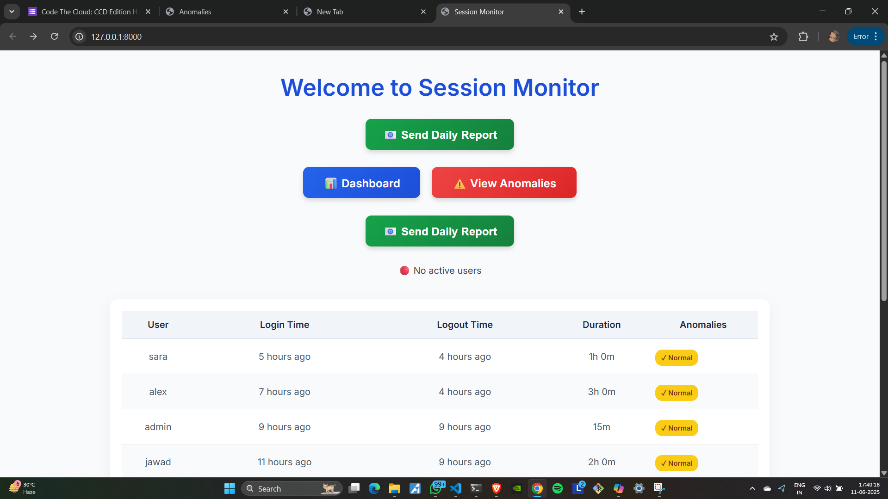
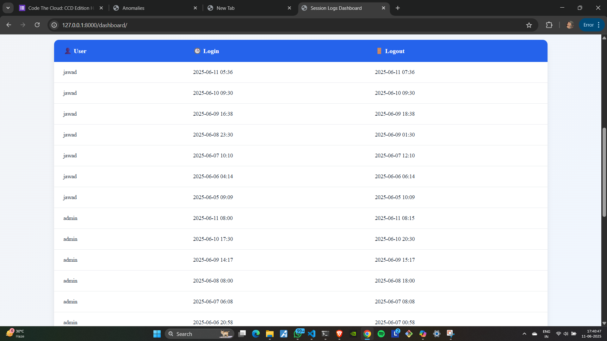
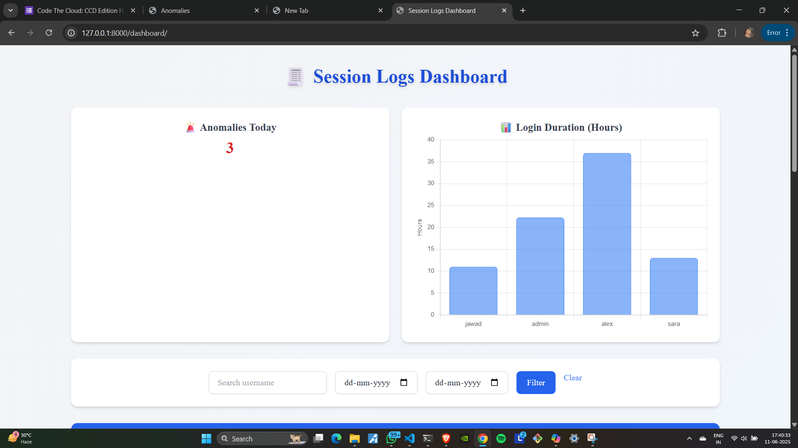
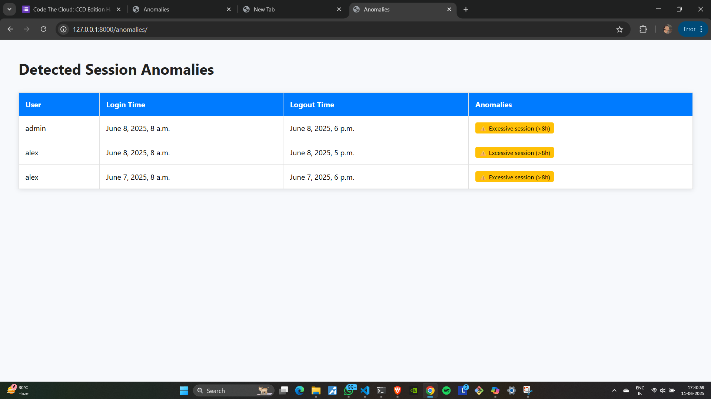

# AI Session Monitoring System

An intelligent system to track user sessions, detect anomalies, and ensure accurate timestamp logging with timezone support. It helps monitor user activity and improve data integrity — a valuable solution for workplace automation.

---

## Overview

The AI Session Monitoring System provides automated logging of session activities, anomaly detection in user behavior, timezone-aware timestamps, and scheduled email reporting. It's powered by a Django backend and has a user-friendly dashboard for monitoring.

---

## Features

- Session tracking with start/end times
- Anomaly detection based on session behavior
- Timezone-aware timestamp logging
- Daily email reports for flagged anomalies
- Dashboard to view session logs and detect issues
- Easily extendable Django project structure

---

## Screenshots

Here’s what the system looks like:

### Homepage


### User Data Table


### Dashboard View


### Anomalies Detected


---

## Installation


1. Clone the repository :
   ```bash
   git clone https://github.com/jawad-zaidi-026/AI-SESSION-MONITORING-SYSTEM.git
   cd AI-SESSION-MONITORING-SYSTEM

   
2. Create and activate a virtual environment :


```bash
Copy
    Edit
    python -m venv project_env
    project_env\Scripts\activate  # For Windows
    # or
    source project_env/bin/activate  # For Mac/Linux
```


3. Install dependencies :


```bash
    Copy
    Edit
    pip install -r requirements.txt
```


4. Run migrations and start the server :


```bash
    Copy
    Edit
    python manage.py migrate
    python manage.py runserver
```


5. Visit: http://127.0.0.1:8000


6. Usage :
   
-The system automatically logs sessions.
-Use the dashboard (/dashboard) to view activity.
-Populate fake logs (for testing):

```bash
    python populate_logs.py
```

7. Send daily email reports :

```bash
python daily_email.py
```


8. Project Structure :


AI-SESSION-MONITORING-SYSTEM/
├── sessionmonitor/           # Django project settings
├── tracker/                  # App with core logic
├── staticfiles/              # CSS and JS assets
├── Images/                   # Screenshots
├── populate_logs.py          # Auto-generate logs
├── extract_logs.py           # Utility script
├── daily_email.py            # Sends reports
├── manage.py                 # Django entry point
└── requirements.txt          # Dependencies


9. Tech Stack :
    
-Backend: Django, Python
-Frontend: HTML, CSS, Bootstrap, TailwindCss
-Database: SQLite (can upgrade to PostgreSQL)
-Scheduling/Automation: Python scripts

10. Contact :
    
Feel free to connect if you'd like to contribute or need help.

-Email: official.jawadzaidi@gmail.com
-Phone: +91 8591797203
-GitHub: @jawad-zaidi-026


